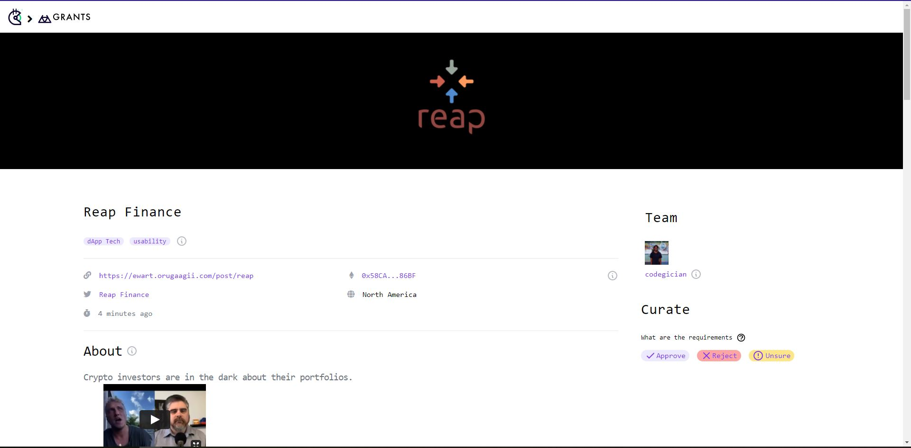
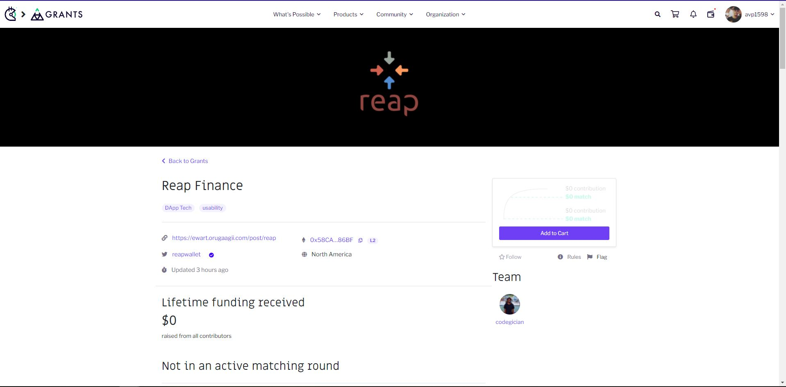

# Grant Curation Game User Interface & Backend

This project is a submission to the curation game user grant on Gitcoin.

## Design Approach

### UI

For the basic UI we decided to use the same frontend Gitcoin uses to display the grants. With this approach Gitcoin can easily integrate this project in their website.

Check the similarities below




Try running some of the following tasks:

```shell
npx hardhat accounts
npx hardhat compile
npx hardhat clean
npx hardhat test
npx hardhat node
node scripts/sample-script.js
npx hardhat help
```
