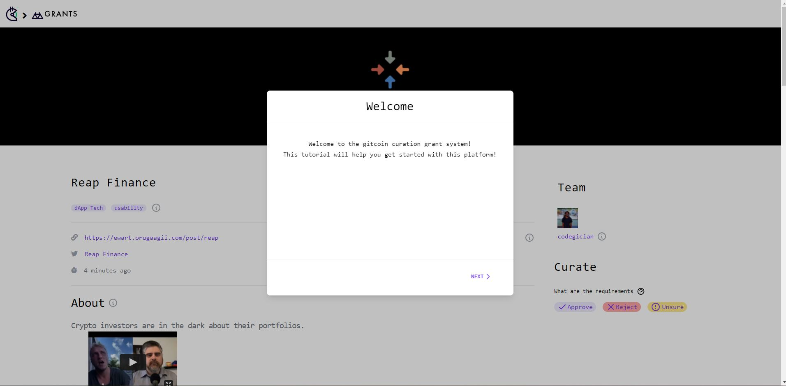
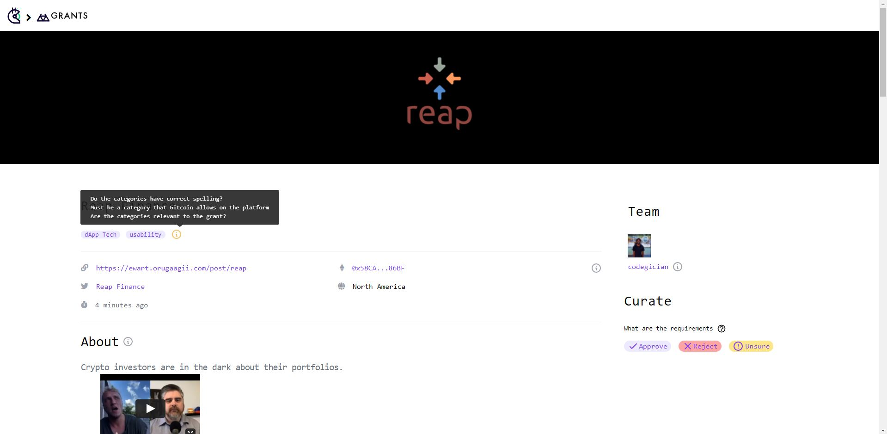
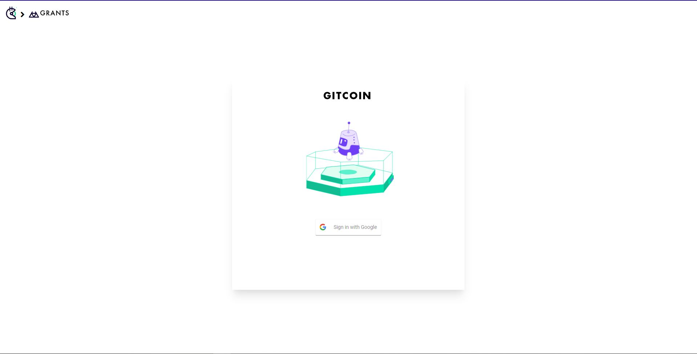

# Curated

This project is a grant curation crowdsourcing application that was created during the Decentralized Governance Hackathon on Gitcoin and submitted to this bounty - https://gitcoin.co/issue/gitcoinco/skunkworks/245/100026394.

## Design Approach

For the prototype, we have thought about and addressed the following in a grant curation crowdsourcing application that is fully decentralized.

### **1. Curation confidence**

How to calculate the confidence of the aggregated curations for many curations for a certain grant?

Currently, our system uses a basic formula for calculating confidence given by,

```shell
confidence = most_frequent_curation / total_curations
```

### **2. Interface simplicity**

We made the interface similar to Gitcoin grants page and added a bit of gamification with badges. This is to make sure the user (who we are assuming has already interacted with the Gitcoin platform before) will find it very easy to use the curation platform while also have a sense of accomplishment upon leveling up or receiving a badge. The UI can be easily integrated in the current Gitcoin application. On top of the gitcoin grant interface we have added 3 curate buttons.

Check the similarities below

**Our app**


**Gitcoin**


### **3. User Guidance**

The user is given a proper tutorial when they first visit and sign in our app. We also have hints at various sections which indicating the requirements.

**Initial Tutorial**


**Helpers/Hints**


### **4. Sybil Attack/ Bots Prevention**

To prevent sybil attacks and bots, we only allow the app to be used if they sign in with google. Since in the future we expect this app to be integrated with the Gitcoin app, we can directly use from gitcoin the user logged info and can even allow the user to curate only of their trust is above lets say 50%. For now we have created a temporary login page.

**Login page**


### **5. Curator incentivization**

Curators are rewarded for curating a grant based on their streak and the total streak of all curators that have curated that grant. For example, if there are 50 curators for a grant and all of them have a streak of 5, they will all get an equal share of the rewards for that grant. However, if one person has a streak of 10, their reward share will be calculated as follows:

```shell
reward = 10 / (5 * 49 + 10 * 1)
```

A streak is only broken if there is high confidence about a curation (above 90) but a curator curates it wrongly.

The advantage of having a streak based system is that a bot or fraudalent user can never get a high reward. This method incentivizes curation correctness (having a streak of 0 would suck) and speed of curation (having a streak much lower than others would mean a smaller share of the pie) at the same time and lets the curator find the optimal balance between the two.

It is not possible to know if this incentivization method works well for such a system without experimentation but its a good starting point.

One disadvantage of this method is that it doesn't completely get rid of bots. Someone can still make an income by running a bot. However, it would be much easier to identify bots as we can easily check the rewards earned against number of total curations.

### **6. Verifiebility**

When we send the grant result for a particular grant, we include an ipfs link which contains the information about all the curations, since IPFS links cannot be changed, this can be used as a way to verify data if needed.

## Backend

We have used **Moralis** as our backend. In Moralis we have created 3 tables which help us in maintaining the state of our app. The detailed schema is given below.

## APIS

> /getAllCurations

> /getGrantsById

## How to run locally

Run the following commands

```shell
git clone https://github.com/adityachakra16/curated.git
cd app
yarn install
yarn start
```

Sign in with any google account

## Summary (and some other design considerations)

Although the application in its current state is centralized (as it uses a centralized server for storing curation metadata) to create a good user experiance and keep it secure, it can be progressively decentralized over time with some tradeoffs.

For instance, each curation can be stored on IPFS and the content identifiers can be stored on chain. The curator's transaction fees can be forwarded to the grant owner using something like Biconomy. However, this system would sacrifice on the user experience as the curator would have to sign a transaction for each curation.
